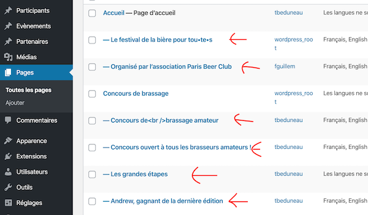

# Ajouter ou modifier du contenu sur le site

## Connexion
Pour ajouter ou modifier du contenu vous devez d'abord vous connecter à l'adresse suivante : https://parisbeerfestival.fr/login

Si vous n'avez pas de compte, demandez-en un sur Discord à `@Web-Francois` dans la chaine `#Web`.

Une fois connecté, vous arrivez dans l'interface d'administration du site.

Pour visualiser le site, vous pouvez cliquer sur le lien `Paris Beer Festival` en haut à gauche de l'interface.

## Rajouter/modifier des participants, événements ou Partenaires

Dans la colonne de gauche de l'interface se trouvent les liens qui permettent de gérer le contenu du site.

Cliquez sur l'un d'eux pour afficher la liste des contenus déjà saisis. Vous pouvez ensuite cliquer sur "Ajouter" pour créer un nouveau contenu ou bien cliquer sur un contenu existant pour le modifier.

Remarquez dans l'interface le bouton qui permet d'éditer la version française ou anglaise de l'élément.

Chaque type de contenu requiert un titre et une description mais aussi quelques données spécifiques.

## Participants
Un participant doit avoir une adresse et une et une seule catégorie. Pour l'adresse, tapez-là dans le champ correspondant puis cliquez sur le bouton "rechercher coordonnées" pour obtenir les coordonnées GPS. Pour l'instant on ne s'en sert pas, mais cela permettra de créer une carte interactive plus tard.

## Evénements
Un événement doit être associé à un ou plusieurs participants. Dans le cas où plusieurs participants organisent un événement, il faut rentrer en premier le participant qui héberge l'événement.

Si l'événement n'a pas lieu chez le participant, alors il faut indiquer une adresse. Sinon il faut laisser le champ adresse vide.

## Partenaires
Les partenaires ont un "niveau" qui détermine l'ordre dans lequel ils apparaissent sur le site. Les partenaires de niveau 1 sont affichés en premier, ceux de niveau 4 en dernier.

# Modifier le contenu de la page d'accueil et de la page Brassam
Ca se passe tout simplement dans la partie "pages" !

Le contenu de chaque section de ses deux pages est contenu dans une sous-page.
